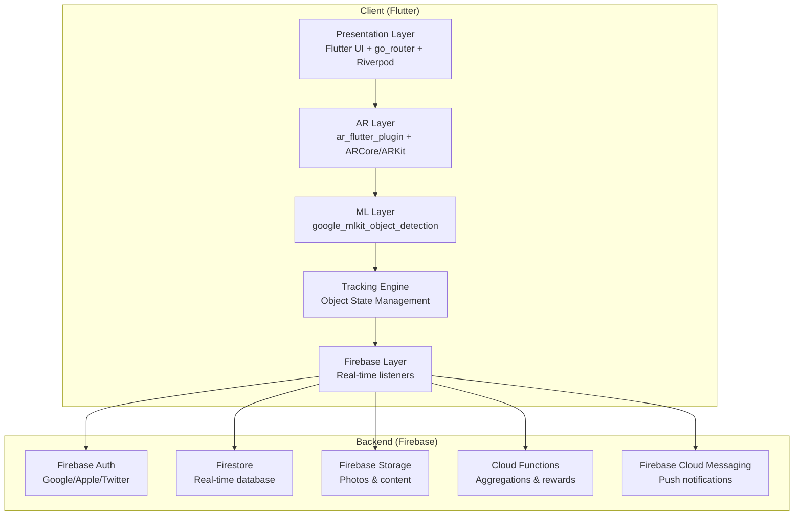
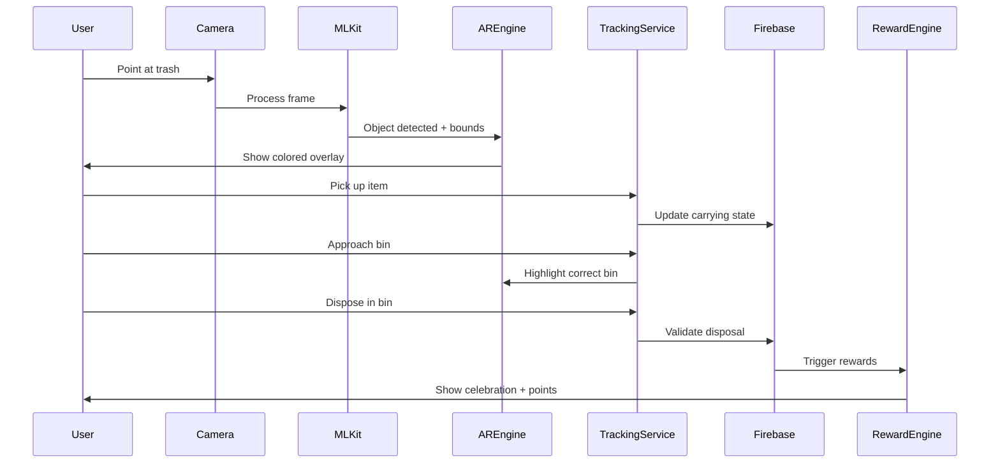
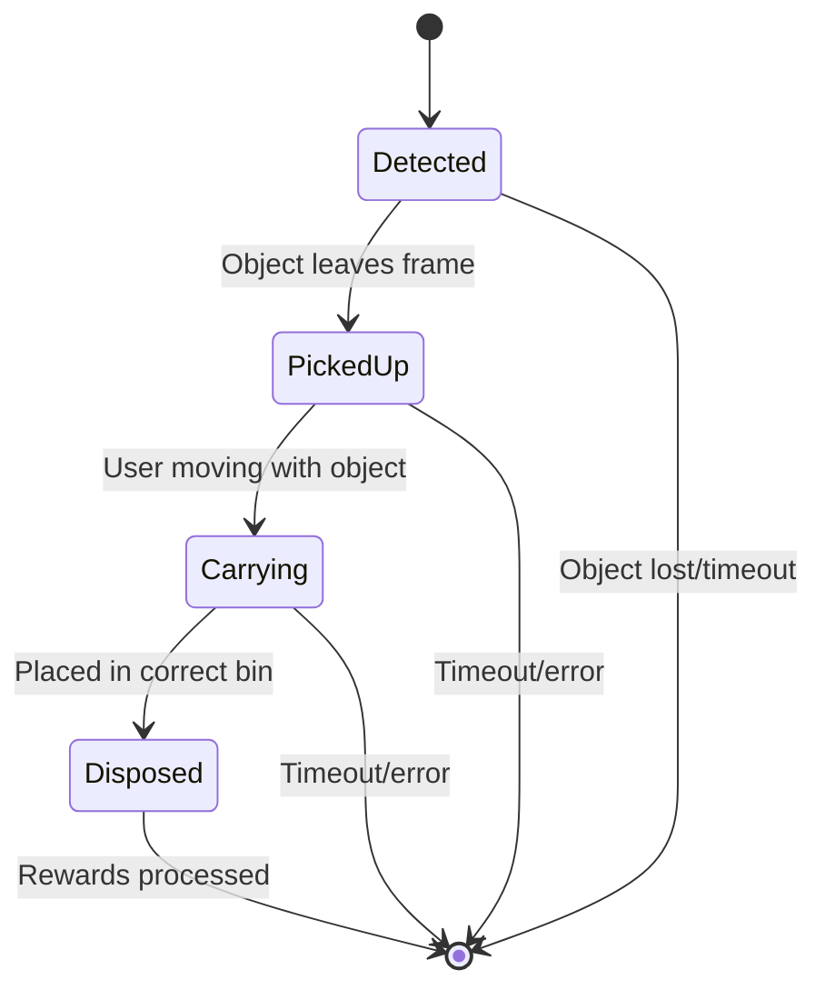

# Design Document

## Overview

CleanCity Vibe is an AR-powered mobile application that gamifies urban cleanup through real-time object detection, tracking, and reward systems. The architecture leverages Flutter for cross-platform development, Firebase for backend services, and ML Kit for on-device object detection to create a seamless real-time experience.

The core user flow involves: Camera detection → AR overlay → Pick-up tracking → Proximity-based bin highlighting → Disposal validation → Instant rewards → Social sharing.

## Architecture

### System Architecture



### Data Flow Architecture



## Components and Interfaces

### 1. AR Detection Engine

**Purpose:** Real-time trash detection with colored AR overlays

**Key Classes:**
- `ARDetectionService`: Manages ML Kit integration and AR overlay rendering
- `ObjectTracker`: Assigns and maintains tracking IDs across frames
- `CategoryMapper`: Maps ML Kit labels to bin categories with confidence scoring

**Interfaces:**
```dart
abstract class ARDetectionService {
  Stream<List<DetectedObject>> get detectionStream;
  Future<void> startDetection();
  Future<void> stopDetection();
  void updateOverlayColors(Map<String, Color> categoryColors);
}

class DetectedObject {
  final String trackingId;
  final String category;
  final String codeName; // EcoGems, FuelShards, etc.
  final Rect boundingBox;
  final double confidence;
  final DateTime detectedAt;
}
```

### 2. Object Tracking Service

**Purpose:** Track user interactions with detected objects through state transitions

**State Machine:**


**Key Classes:**
- `ObjectTrackingService`: Core state management
- `UserInventory`: Manages current carrying items
- `StateTransitionValidator`: Validates state changes

**Interfaces:**
```dart
abstract class ObjectTrackingService {
  Stream<UserInventory> get inventoryStream;
  Future<void> updateObjectState(String trackingId, ObjectState newState);
  Future<List<CarryingItem>> getCurrentInventory(String userId);
}

enum ObjectState { detected, pickedUp, carrying, disposed }

class CarryingItem {
  final String trackingId;
  final String category;
  final String codeName;
  final DateTime pickedUpAt;
  final GeoPoint pickupLocation;
}
```

### 3. Proximity Detection Module

**Purpose:** Detect when user approaches bins while carrying tagged items

**Key Classes:**
- `ProximityService`: GPS monitoring and geofence management
- `BinLocationService`: Firestore queries for nearby bins
- `BinHighlighter`: AR highlighting logic

**Interfaces:**
```dart
abstract class ProximityService {
  Stream<List<NearbyBin>> get nearbyBinsStream;
  Future<void> startLocationTracking();
  void updateUserInventory(List<CarryingItem> items);
}

class NearbyBin {
  final String binId;
  final String category;
  final GeoPoint location;
  final double distance;
  final bool shouldHighlight;
  final Color highlightColor;
  final List<String> matchingTrackingIds;
}
```

### 4. Reward Engine

**Purpose:** Instant visual effects and point distribution

**Key Classes:**
- `RewardAnimationController`: Manages celebration animations
- `PointsCalculator`: Determines point values based on disposal accuracy
- `BadgeUnlockService`: Handles achievement unlocks

**Interfaces:**
```dart
abstract class RewardEngine {
  Future<RewardResult> processDisposal(DisposalEvent event);
  Stream<AnimationTrigger> get animationStream;
  Future<void> showCelebration(CelebrationType type);
}

class RewardResult {
  final int pointsAwarded;
  final List<Badge> badgesUnlocked;
  final CelebrationType celebrationType;
  final String feedback;
}
```

## Data Models

### Core Data Models

```dart
// User Profile
class UserProfile {
  final String uid;
  final String displayName;
  final String email;
  final String? avatarUrl;
  final UserStats stats;
  final List<CarryingItem> currentSession;
  final List<Badge> badges;
  final DateTime createdAt;
  final DateTime lastActiveAt;
}

class UserStats {
  final int totalPoints;
  final int itemsCollected;
  final int correctDisposals;
  final int currentStreak;
  final Map<String, int> categoryBreakdown;
}

// Live Action Event
class LiveAction {
  final String actionId;
  final String userId;
  final ActionType type;
  final ObjectData objectData;
  final GeoPoint location;
  final BinData? binData;
  final int pointsAwarded;
  final DateTime timestamp;
  final bool processed;
}

enum ActionType { detection, pickup, disposal }

class ObjectData {
  final String trackingId;
  final String category;
  final String codeName;
  final double confidence;
  final Rect? boundingBox;
}

// Bin Location
class BinLocation {
  final String binId;
  final String category;
  final String codeName;
  final GeoPoint location;
  final String geohash;
  final BinStyle style;
  final bool isActive;
  final DateTime lastUpdated;
}

class BinStyle {
  final Color color;
  final String iconPath;
  final String highlightEffect;
}

// Mission
class Mission {
  final String missionId;
  final String title;
  final String description;
  final MissionType type;
  final TimeWindow timeWindow;
  final GeoCircle location;
  final MissionRequirements requirements;
  final MissionRewards rewards;
  final int participantCount;
  final bool isActive;
}

enum MissionType { cleanupSpree, perfectSorting, hotspotHero }

class TimeWindow {
  final DateTime start;
  final DateTime end;
  final Duration? timeLimit;
}

class GeoCircle {
  final GeoPoint center;
  final double radiusMeters;
}
```

### Firestore Schema Design

**Collections Structure:**
```
/users/{userId}
/actions/{actionId}
/bins/{binId}
/leaderboards/{period}
/missions/{missionId}
/hotspots/{hotspotId}
/user_sessions/{userId}/carrying/{trackingId}
```

**Indexing Strategy:**
- Geohash indexes for spatial queries (bins, hotspots)
- Composite indexes for leaderboard queries (period + points)
- TTL indexes for temporary data (user sessions, expired actions)

## Error Handling

### Client-Side Error Handling

**Network Connectivity:**
- Connection loss detection with retry mechanisms
- User-friendly "connection required" messaging
- Critical action queuing for when connection resumes

**AR/ML Kit Failures:**
- Graceful fallback to manual object tagging
- Device capability detection and appropriate messaging
- Performance degradation handling (reduce detection frequency)

**GPS/Location Issues:**
- Last known location fallback with accuracy warnings
- Indoor location handling with manual bin selection
- Permission denied graceful handling

### Server-Side Error Handling

**Cloud Functions:**
```javascript
// Error handling pattern for disposal validation
exports.validateDisposal = functions.firestore
  .document('actions/{actionId}')
  .onCreate(async (snap, context) => {
    try {
      const result = await processDisposal(snap.data());
      return result;
    } catch (error) {
      console.error('Disposal processing failed:', error);
      
      // Idempotency check
      if (error.code === 'already-processed') {
        return { success: true, duplicate: true };
      }
      
      // Rate limiting
      if (error.code === 'rate-limit-exceeded') {
        return { success: false, error: 'Too many actions' };
      }
      
      // Validation errors
      if (error.code === 'invalid-data') {
        return { success: false, error: error.message };
      }
      
      // Unknown errors
      throw new functions.https.HttpsError(
        'internal',
        'Processing failed',
        error
      );
    }
  });
```

## Testing Strategy

### Unit Testing
- **AR Detection Engine:** Mock ML Kit responses, test overlay rendering
- **Object Tracking:** State machine transitions, inventory management
- **Proximity Detection:** Geofence calculations, bin matching logic
- **Reward Engine:** Point calculations, badge unlock conditions

### Integration Testing
- **End-to-End Flows:** Complete detection → disposal → reward cycles
- **Firebase Integration:** Real-time listener behavior, security rules
- **Cross-Platform:** iOS/Android feature parity testing

### Performance Testing
- **AR Performance:** Frame rate monitoring, memory usage profiling
- **Network Efficiency:** Firestore query optimization, bandwidth usage
- **Battery Impact:** Background processing, location tracking efficiency

### Security Testing
- **Authentication:** OAuth flow security, token handling
- **Authorization:** Firestore security rules validation
- **Input Validation:** Malformed data handling, injection prevention

**Test Environment Setup:**
```yaml
# Firebase Emulator Suite configuration
firebase.json:
  emulators:
    auth:
      port: 9099
    firestore:
      port: 8080
    functions:
      port: 5001
    storage:
      port: 9199
```

**Automated Testing Pipeline:**
- Unit tests run on every commit
- Integration tests on pull requests
- Performance benchmarks on release candidates
- Security scans on production deployments

## Enhanced Waste Categorization System

### Overview

The improved waste categorization system enhances the existing `WasteCategory.fromMLKitLabel()` method to provide significantly more accurate object classification. The design leverages comprehensive keyword mappings, fuzzy string matching, and intelligent category prioritization to achieve 80%+ accuracy across all waste categories.

### Enhanced WasteCategory Architecture

```dart
class WasteCategory {
  // Enhanced fromMLKitLabel method with multi-label support
  static WasteCategory? fromMLKitLabel(String label, double confidence);
  static WasteCategory? fromMultipleLabels(List<DetectedObjectLabel> labels);
  
  // Advanced matching algorithms
  static double calculateCategoryConfidence(String label, WasteCategory category);
  static List<String> preprocessLabel(String label);
  static bool matchesKeywords(String label, List<String> keywords, {bool fuzzy = false});
  
  // Category prioritization system
  static WasteCategory? findBestCategoryMatch(String label);
  static WasteCategory resolveCategoryConflict(List<CategoryMatch> matches);
}
```

### Keyword Mapping System

**Category Priority Hierarchy:**
1. **Hazardous** (Priority: 1.0) - Safety critical items
2. **E-waste** (Priority: 0.8) - Special handling required
3. **Recycle** (Priority: 0.6) - Environmental benefit
4. **Organic** (Priority: 0.4) - Composting materials
5. **Landfill** (Priority: 0.2) - Fallback category

**Enhanced Keyword Structure:**
```dart
class CategoryKeywords {
  final List<String> exactMatches;      // Direct string matches
  final List<String> fuzzyMatches;      // Substring matches
  final List<String> compoundKeywords;  // Multi-word phrases
  final double categoryWeight;          // Priority weight
}
```

### Label Processing Pipeline

1. **Confidence Validation**: Reject labels below 30% confidence
2. **Label Preprocessing**: Normalize case, remove special characters
3. **Multi-Label Analysis**: Process all available ML Kit labels
4. **Fuzzy Keyword Matching**: Handle variations and compound labels
5. **Category Prioritization**: Apply hierarchy weights for conflicts
6. **Confidence Scoring**: Calculate final categorization confidence

### Performance Optimization

- **Processing Time**: <10ms per object categorization
- **Memory Overhead**: <1MB additional memory usage
- **Caching Strategy**: Cache frequent label-to-category mappings
- **Batch Processing**: Optimize for multiple simultaneous objects

### Testing and Validation

**Accuracy Targets:**
- Recyclable items: 80%+ accuracy
- Organic waste: 80%+ accuracy
- Electronic waste: 85%+ accuracy
- Hazardous materials: 80%+ accuracy

**Test Coverage:**
- Unit tests for all keyword matching algorithms
- Integration tests with real ML Kit output
- Performance benchmarks for processing speed
- Accuracy validation with diverse object sets