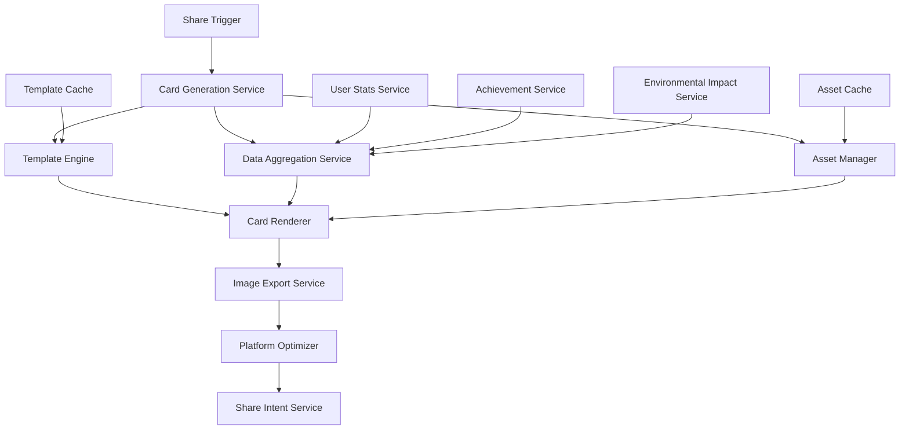

# Design Document

## Overview

The Social Media Card Generation feature will create visually appealing, branded cards that users can share across social media platforms. The system will generate dynamic cards containing user statistics, achievements, environmental impact metrics, and motivational messaging. Cards will be optimized for different social platforms and generated efficiently using Flutter's rendering capabilities.

## Architecture

### High-Level Architecture



### Service Integration

The card generation system integrates with existing CleanClik services:
- **UserInventoryService**: For current inventory and categorization stats
- **PointsCalculatorService**: For points, levels, and streaks
- **ProximityService**: For location-based achievements
- **ARDetectionService**: For recent detection activity

## Components and Interfaces

### 1. SocialCardGenerationService

Primary service responsible for orchestrating card generation:

```dart
class SocialCardGenerationService {
  Future<File> generateCard({
    required CardTemplate template,
    required CardData data,
    required SocialPlatform platform,
  });
  
  Future<List<CardTemplate>> getAvailableTemplates();
  Future<CardData> aggregateUserData();
  void cacheTemplate(CardTemplate template);
}
```

### 2. CardTemplate System

Template-based approach for different card layouts:

```dart
abstract class CardTemplate {
  String get id;
  String get name;
  CardDimensions get dimensions;
  Widget buildCard(CardData data);
}

class AchievementFocusedTemplate extends CardTemplate {
  // Highlights recent achievements and badges
}

class ImpactFocusedTemplate extends CardTemplate {
  // Emphasizes environmental impact metrics
}

class ProgressFocusedTemplate extends CardTemplate {
  // Shows level progression and streaks
}
```

### 3. CardData Model

Aggregated data structure for card content:

```dart
class CardData {
  final UserStats userStats;
  final List<Achievement> recentAchievements;
  final EnvironmentalImpact impact;
  final StreakInfo currentStreak;
  final List<RecentActivity> recentActivity;
  final String motivationalMessage;
  final String callToAction;
}
```

### 4. Platform Optimization

Different dimensions and optimizations per platform:

```dart
enum SocialPlatform {
  instagram, // 1080x1080 square
  twitter,   // 1200x675 landscape
  facebook,  // 1200x630 landscape
  stories,   // 1080x1920 vertical
}

class PlatformOptimizer {
  CardDimensions getDimensions(SocialPlatform platform);
  Map<String, String> getMetaTags(SocialPlatform platform, CardData data);
  String optimizeText(String text, SocialPlatform platform);
}
```

### 5. Card Renderer

Flutter widget-to-image conversion:

```dart
class CardRenderer {
  Future<ui.Image> renderWidget(Widget widget, Size size);
  Future<File> saveAsImage(ui.Image image, String filename);
  Future<Uint8List> getImageBytes(ui.Image image);
}
```

## Data Models

### CardData Structure

```dart
class CardData {
  final String userName;
  final String userLevel;
  final int totalPoints;
  final int currentStreak;
  final List<String> recentBadges;
  final EnvironmentalImpact impact;
  final String profileImageUrl;
  final DateTime lastActivity;
  final String locationName;
}

class EnvironmentalImpact {
  final int itemsCategorized;
  final double co2Saved; // in kg
  final int treesEquivalent;
  final String impactMessage;
}
```

### Template Configuration

```dart
class TemplateConfig {
  final String backgroundGradient;
  final List<Color> brandColors;
  final TextStyle titleStyle;
  final TextStyle bodyStyle;
  final EdgeInsets padding;
  final BorderRadius borderRadius;
  final List<TemplateElement> elements;
}

class TemplateElement {
  final ElementType type;
  final Alignment alignment;
  final Size size;
  final Map<String, dynamic> properties;
}
```

## Error Handling

### Generation Failures

```dart
class CardGenerationException implements Exception {
  final String message;
  final CardGenerationError errorType;
  final dynamic originalError;
}

enum CardGenerationError {
  templateNotFound,
  dataAggregationFailed,
  renderingFailed,
  exportFailed,
  insufficientData,
}
```

### Fallback Strategies

1. **Template Fallback**: Use basic template if preferred template fails
2. **Data Fallback**: Use cached data if live data unavailable
3. **Offline Mode**: Generate cards with available cached data
4. **Simplified Cards**: Generate text-only cards if image generation fails

## Testing Strategy

### Unit Tests

1. **Template Rendering**: Test each template with various data combinations
2. **Data Aggregation**: Verify correct data collection from services
3. **Platform Optimization**: Test dimension and format conversions
4. **Caching Logic**: Verify template and asset caching behavior

### Widget Tests

1. **Card Templates**: Test widget rendering for each template
2. **Responsive Design**: Test cards at different dimensions
3. **Data Binding**: Verify correct data display in templates
4. **Error States**: Test error handling in UI components

### Integration Tests

1. **End-to-End Generation**: Test complete card generation flow
2. **Platform Sharing**: Test sharing to different social platforms
3. **Offline Functionality**: Test card generation without network
4. **Performance**: Measure generation time and memory usage

### Performance Testing

1. **Generation Speed**: Target <3 seconds for card generation
2. **Memory Usage**: Monitor memory during image rendering
3. **Cache Efficiency**: Test template and asset cache hit rates
4. **Concurrent Generation**: Test multiple simultaneous card requests

## Implementation Phases

### Phase 1: Core Infrastructure
- Basic card generation service
- Simple template system
- Widget-to-image rendering
- Basic data aggregation

### Phase 2: Template Variety
- Multiple card templates
- Platform-specific optimizations
- Enhanced visual design
- Branding integration

### Phase 3: Advanced Features
- Customization options
- Offline functionality
- Performance optimizations
- Analytics integration

### Phase 4: Social Integration
- Platform-specific sharing
- Meta tag generation
- Deep linking support
- Viral features

## Technical Considerations

### Performance Optimizations

1. **Template Caching**: Cache compiled templates in memory
2. **Asset Preloading**: Preload common assets and fonts
3. **Background Generation**: Generate cards in background isolates
4. **Lazy Loading**: Load templates and assets on demand

### Memory Management

1. **Image Disposal**: Properly dispose of rendered images
2. **Cache Limits**: Implement LRU cache with size limits
3. **Isolate Usage**: Use isolates for heavy rendering operations
4. **Resource Cleanup**: Clean up temporary files and resources

### Platform Considerations

1. **iOS Sharing**: Use UIActivityViewController for native sharing
2. **Android Sharing**: Use Intent.ACTION_SEND for sharing
3. **File Storage**: Use temporary directory for generated images
4. **Permissions**: Handle storage permissions for image saving